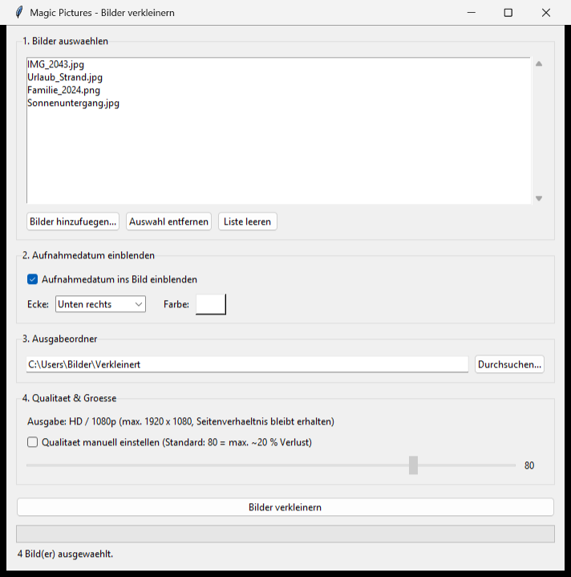

# Magic Pictures


[](LICENSE)


*Read this in [English](README.en.md).*

Eine kleine Windows-Desktop-App zum Verkleinern von Bildern auf **HD/1080p** –
mit optionaler Einblendung des **Aufnahmedatums**.



## Funktionen

- 📂 **Bilder importieren / auswählen** (Mehrfachauswahl)
- 📅 **Aufnahmedatum** (aus EXIF) optional ins Bild einblenden
  - Auswahl der **Ecke** (oben/unten, links/rechts)
  - Auswahl der **Textfarbe**
- 💾 **Ausgabeordner** frei wählbar
- 🖼️ Ausgabe in **HD-Qualität** (max. 1920 × 1080, Seitenverhältnis bleibt erhalten)
- 🎚️ Qualität standardmäßig **80** (≈ max. 20 % Qualitätsverlust), bei Bedarf
  **manuell einstellbar** (1–100)

## Starten

### Variante A – mit installiertem Python
Voraussetzung: Python 3.10+ und [Pillow](https://pypi.org/project/pillow/).

```bash
pip install -r requirements.txt
python magic_pictures.py
```

Oder per Doppelklick auf **`Magic-Pictures starten.bat`**.

### Variante B – portable EXE (ohne Python)
Doppelklick auf **`Portable-EXE bauen.bat`** erzeugt eine eigenständige
`dist\Magic-Pictures.exe`, die ohne installiertes Python läuft (z. B. vom
USB-Stick).

## Icon anpassen

Das App-Icon wird von `icon_erstellen.py` erzeugt:

```bash
python icon_erstellen.py
```

## Projektdateien

| Datei | Zweck |
|-------|-------|
| `magic_pictures.py` | Die App (Tkinter-Oberfläche + Bildverarbeitung) |
| `icon_erstellen.py` | Generator für `icon.ico` / `icon.png` |
| `Magic-Pictures starten.bat` | Start per Doppelklick (benötigt Python) |
| `Portable-EXE bauen.bat` | Baut die portable EXE mit PyInstaller |
| `requirements.txt` | Python-Abhängigkeiten (Pillow) |

## Lizenz

Veröffentlicht unter der [MIT-Lizenz](LICENSE) – frei nutzbar, veränderbar und
weitergebbar, ohne Gewährleistung.
